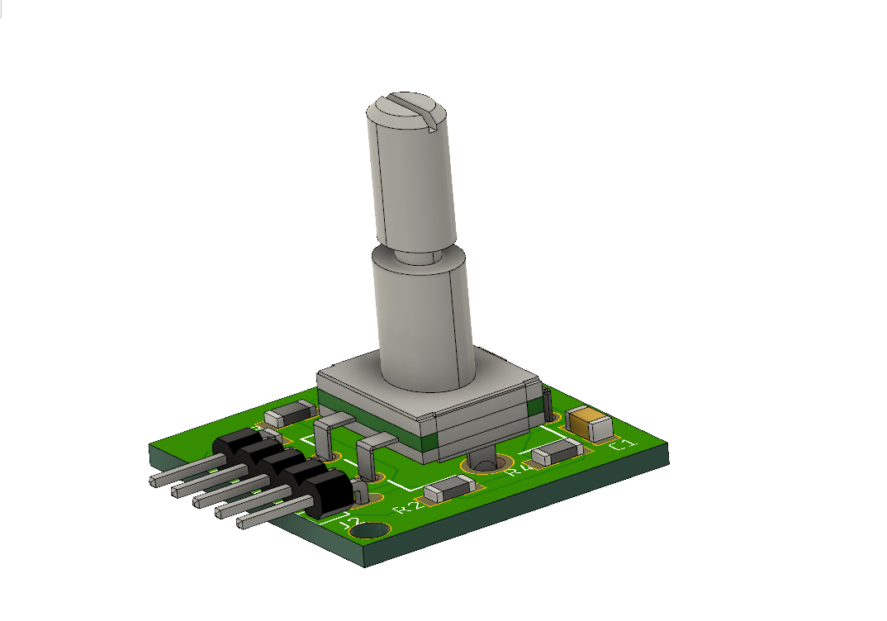

# encoder-debouncier-circuit-and-design-block

I've tried to use an encoder in one of my previous projects and it was quite hard to use due to the bouncing. Here is two version of encoder debouncer circuits (as an Eagle Design Blocks .dbl) with links where I found them and I've created some modules to test them (.brd, and .sch files). The second version had been implemented and it worked fine for me. I've managed to create a quite cool UI with it. Every component has 3D model, so I've synced it with Fusion360 too. Here is how it's look: 

*[ROBERT DEE](https://grabcad.com/library/rotary-encoder-6)s encoder model had been used from GrabCAD*

**How to connect (module to board):**
- 5V - supply voltage
- GND - ground
- SW - button input, digital in
- DT - B channel of encoder
- CLK - A channel of encoder
